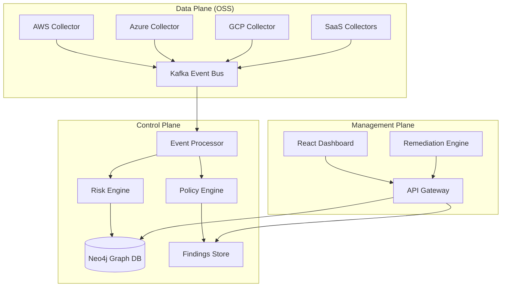

<p align="center">
  
</p>

<h1 align="center">🔐 SecuRizon</h1>
<p align="center">
  <strong>Real-Time Security Posture & Attack Surface Management</strong>
</p>

<p align="center">
  <a href="LICENSE"></a>
  
  
  
  
  
</p>

---

## 🌟 Overview

**SecuRizon** is an open-core, real-time security posture and attack surface management platform. It continuously discovers assets, correlates security events with business context, and identifies exploitable attack paths across multi-cloud and SaaS environments.

### 🎯 Why SecuRizon?
Traditional CSPM/SSPM tools are periodic, compliance-driven, and reactive. They produce static findings that lack real-time context, risk prioritization, and attacker perspective.

**SecuRizon is different:**
- ⚡ **Real-time detection** (<1 minute MTTD) using event-driven architecture.
- 🧠 **Risk-aware scoring** that considers business context, exposure, and threat intelligence.
- 🕸️ **Attack path analysis** that shows how misconfigurations chain together into real exploits.
- 🌐 **Unified view** of AWS, Azure, GCP, GitHub, Jira, and hybrid environments.
- 🔓 **Open-core model** with enterprise features for commercial use.

---

## 🚀 Key Features

### 🔍 Real-Time Asset Discovery
- **Multi-cloud support:** AWS, Azure, GCP with API polling + event streams.
- **SaaS integrations:** GitHub, Jira, Salesforce, and more via extensible connectors.
- **Agent & agentless:** Lightweight agents for deeper visibility, API-based for everything else.
- **Relationship mapping:** Identity → Resource → Network → Data relationships.

### ⚡ Event-Driven Security
- **Real-time detection:** Process CloudTrail, Activity Logs, Audit Logs as they happen.
- **Policy engine:** 200+ built-in policies (CIS, NIST, custom).
- **Risk scoring:** Contextual risk with exposure × environment × threat intelligence.
- **Automated findings:** From misconfiguration to notification in <60 seconds.

### 🎯 Attack Path Intelligence
- **Graph-based analysis:** Neo4j-powered relationship traversal.
- **Time-aware edges:** Historical attack path reconstruction.
- **Prioritized paths:** Focus on exploitable paths to critical assets.
- **Simulation engine:** "What-if" analysis for proposed changes.

### 🔧 Automated Remediation
- **Playbook engine:** YAML-defined remediation workflows.
- **Approval workflows:** Human-in-the-loop for critical changes.
- **Multi-provider actions:** AWS, Azure, GCP, and script-based remediations.
- **Rollback capability:** Automatic rollback on failure.

### 🤝 Customer Success & AI Support
- **Health Monitoring:** Real-time customer health scores and risk alerts.
- **AI Knowledge Base:** Semantic search and AI-generated answers for support.
- **Smart Suggestions:** Automated article suggestions during ticket creation.
- **Quarterly Reviews:** Automated QBR generation with usage analytics.

---

## 🏗 Architecture

### High-Level Flow


### Core Components
| Component | Technology | Purpose |
| :--- | :--- | :--- |
| **Collectors** | Go, Cloud SDKs | Real-time asset discovery and event ingestion |
| **Event Bus** | Kafka/Redpanda | Event streaming and decoupling |
| **Graph Database** | Neo4j | Asset relationships and attack path storage |
| **Event Processor** | Go | Real-time policy evaluation and risk scoring |
| **API Gateway** | Go, gRPC, REST | Unified API interface |
| **Dashboard** | React, TypeScript | Real-time visualization and management |
| **Remediation** | Go | Automated fix execution and workflows |

---

## 🚀 Quick Start

### Docker Compose (Development)
```bash
# Clone the repository
git clone https://github.com/securazion/securazion.git
cd securazion

# Start the development environment
docker-compose -f deployments/docker-compose.dev.yml up -d

# Access the dashboard
open http://localhost:3000
```

### Kubernetes (Production)
```bash
# Add Helm repository
helm repo add securazion https://charts.securazion.com
helm repo update

# Install with Helm
helm install securazion securazion/securazion \
  --namespace securazion \
  --create-namespace \
  --values values-production.yaml
```

---

## 📊 Risk Scoring Algorithm

Risk Score (0-100) is calculated as:
**BaseSeverity × Exposure × Environment × ThreatIntel × DataSensitivity**

| Factor | Criteria | Multiplier |
| :--- | :--- | :--- |
| **Exposure** | Internet-reachable, public sharing | 1.0 - 2.0 |
| **Environment** | Prod (1.5), Staging (1.2), Dev (1.0) | 1.0 - 1.5 |
| **Threat Intel** | Actively exploited, known malware | 1.0 - 2.0 |
| **Data Sensitivity** | Public (1.0) to Restricted (2.0) | 1.0 - 2.0 |

---

## 🏢 Enterprise vs Open Core

| Feature | Open Core | Enterprise |
| :--- | :---: | :---: |
| Asset Discovery | AWS, Azure, GCP | All clouds + SaaS |
| Real-time Events | Basic | Advanced correlation |
| Policy Engine | 50+ policies | 200+ policies + custom |
| Attack Paths | Basic paths | Advanced + simulation |
| Remediation | Manual | Automated + workflows |
| Multi-tenancy | ❌ | ✅ Full isolation |
| Support | Community | 24/7 SLA |

---

## 🤝 Contributing

We welcome contributions! See [CONTRIBUTING.md](CONTRIBUTING.md) for details.

1. Fork the repository
2. Create a feature branch (`git checkout -b feature/amazing-feature`)
3. Commit your changes (`git commit -m 'Add amazing feature'`)
4. Push to the branch (`git push origin feature/amazing-feature`)
5. Open a Pull Request

---

## 📄 License

SecuRizon is released under the **Apache License 2.0** for the open-core components. Enterprise features are available under a commercial license.

Copyright © 2024 SecuRizon, Inc.
